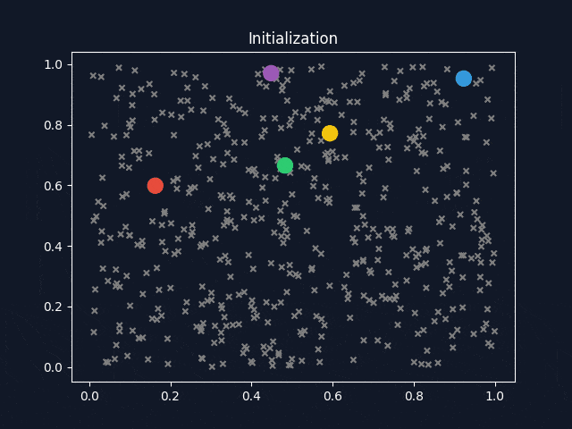

# K-Means Clustering

## What's the Problem

Congrats! The CEO of _Oxygenbnb_ - a service that lets you rent holiday houses - just died and he randomly promoted you to a management role in his will 🤯. As part of your new responsibilities, you should look for ways to help users find the perfect place to stay when they travel. Because you never touch grass 💀, you've actually never opened the app before, but after a few minutes of checking it out you have a gut feeling that the homes on the platform could be categorized into about five distinct tiers based on factors like price, location, size, and overall quality. However, you can’t quite put your finger on exactly what defines these tiers—you just sense that they exist.

For example, here’s a sample of some property data you might have access to:

| Property ID | Location  | Price per Night | Bedrooms | Review Score | Amenities Count |
| ----------- | --------- | --------------- | -------- | ------------ | --------------- |
| 12345       | New York  | $200            | 1        | 4.5          | 10              |
| 67890       | Melbourne | $350            | 2        | 4.8          | 12              |
| 54321       | Warsaw    | $120            | 3        | 3.9          | 8               |

Each property has its own characteristics, and there’s a wide variety in both pricing and features, from luxury hypehouses to lil cozy cottagcore houses. You believe that if you could somehow group similar properties together into 5 distinct tiers, it would not only help travelers make decisions but also give you insights into the types of homes Oxygenbnb offers.

So the question is: Is there a way to group similar properties together based on their features (like price, location, size, and reviews) and discover these 5 tiers?

## What is K-Means Clustering?

K-Means Clustering is a very simple unsupervised machine learning algorithm that tries to partition points in some multivariable space into $K$ distinct non-overlapping groups (clusters) such that each data point belongs to **exactly one group**. It can be summarised pretty quickly as follows

1. Input a set of data points and specify the number of clusters, $K$, you want to try and separate them into
2. Randomly select $K$ different data points. These data points are your initial **centroids**. Each centroid is a representative of a cluster.
3. While the centroids are still changing:
   1. Assign each data point to the closest cluster (centroid).
   2. For each cluster, recompute the centroid as the average of all the data points belonging to that cluster.

Much like with KNN, the way we determine "closeness" in relation to the centroids and data points is determined by the data itself. In most cases, we can just use **Euclidean distance** again, but then we should make sure to **feature scale** our data at the very start of the algorithm.

Of course, it's also not guaranteed that our centroids will become stationary from iteration to iteration. In that case, it's very common to specify a maximum number of iterations you want the algorithm to run for.

## Evaluation methods

Unlike supervised machine learning algorithms, where we have a ground truth to evaluate some sort of "accuracy", k-means clustering doesn't have such a clear performance metric. Ideally though, a good clustering algorithm should put points in the same cluster close together and far apart from other clusters. From this intuition, we get two common evaluation metrics.

**Sum of Squared Errors (SSE):** This measures the sum of the squared distances between each data point and its assigned centroid. So, a lower SSE score indicates the data points are closer to their respective centroids. Very often, this metric will be used to determine what value of $K$ should be used in a model. The graphs produced in such experiments are often called **elbow graphs** due to their distinctive shape.

**Silhouette Score:** For each data point, $i$, we can also compute its silhouette coefficient, $s(i)$.

$
s(i) = \frac{b(i) - a(i)}{\max(a(i), b(i))}
$

Where $a(i)$ is the mean intra-class distance (distance from $i$ to all other points in its cluster) and $b(i)$ is the mean nearest cluster distance (distance from $i$ to a sample in the nearest cluster that's not the same as $i$).

$s(i)$ is guaranteed to range from $[-1, 1]$, where $s(i) = 1$ indicates the data point is confidently clustered, $s(i) = 0$ represents an unconfident cluster, and $s(i) = -1$ indicates a data point has been assigned the wrong cluster since there's a closer cluster that's different.

## Exercise

<!-- ## Extra Reading: Weaknesses

## Extra Reading: Image Compression

## Extra Reading: Expectation Minimisation

## Extra Reading: Optimisation (k value, minibatch, random sampling) -->
