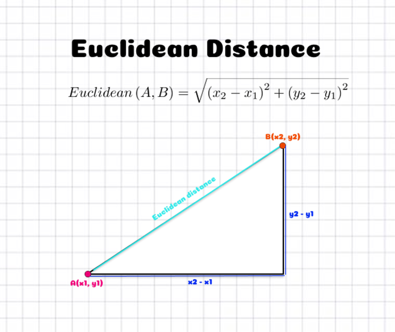

# K-Nearest Neighbours (KNN)

## What's the Problem?

Congrats! You just manufactured your very own car, the _WMB X5_ 😱👑. You think it's a pretty fancy car, so you'd like to try to sell it by sending ads to people who might be interested in buying a new vehicle. Fortunately, your friend _Zark Muckerberg_ runs a social network and collects a lot of data on his users. He runs a small survey to see who'd be interested in buying a new car and sends you the results.

| User ID | Gender | Age | Salary | Interested |
| ------- | ------ | --- | ------ | ---------- |
| 6939211 | Male   | 25  | 83250  | No         |
| 9177299 | Male   | 37  | 76234  | No         |
| 9323247 | Female | 70  | 93668  | Yes        |
...
| 451242142 | Female | 32 | 70904 | No |

For each user on the social network, you can now decide whether to send an ad to them. What you effectively want then is a model that can use the data your friend gave you to take some unseen user data like

| User ID   | Gender | Age | Salary |
| --------- | ------ | --- | ------ |
| 631222142 | Female | 43  | 90090  |

And predict whether that user would be interested in a new car.

## What is K-Nearest Neighbours (KNN)?

KNN is a very simple supervised machine learning algorithm whose logic can effectively be summarised as "Birds of a feather flock together". The idea is to plot all of your data as points in some multivariable space. Then, for each new point of unknown data, we find the _K_ closest data points, and whatever is the most common label among those is the predicted label of our unknown point.

But, how do we measure distance? For now, we'll just use **Euclidean distance**, which is the distance between two points (or vectors) formula that you learnt in high school.

\\[
\text{distance}(x, y) = \sqrt{\sum_{i=1}^{n}(y_i - x_i)^2}
\\]

Which might look more familiar in 2D

So, in the case of our car advertisement, we might decide to use the _Age_ and _Salary_ of users as our training data, and our label will simply be whether they are interested or not interested in a new car. Using the KNN algorithm with the query data above, we thus predict the user is not interested in a new car!

But wait a minute 🤔, just by eyeballing the scatter plot, it seems we didn't pick the closest points?

This is why something called **feature scaling** is important. With distance based algorithms like KNN, features (variables) with bigger numbers can disproportionately influence the distance calculation. Here, salary is going to be of much larger magnitude than age, so our distance metric is going to be more biased towards salary. So, we need to scale our values so that they're comparable.

Two common feature scaling methods are **Min-Max scaling** and **Standardisation**.

Min-Max scaling squeezes values into a specific range, usually [0, 1], and is calculated using the formula:

\\[
x_{scaled} = \frac{x - x_{min}}{x_{max} - x_{min}}
\\]

Standardisation does a similar thing by centering the values around the mean (transformed to 0) and scaling them based on the standard deviation. While this doesn't limit the values to a range, this will usually place them around -1 to 1.

\\[
x_{scaled} = \frac{x - \text{mean}}{\text{standard deviation}} = \frac{x - \mu}{\sigma}
\\]

Usually, you should try both to see which one works better, but we're going to go ahead and use Standardisation.

## Exercise

Your task is to implement a KNN classifier. You must implement `euclidean_distance()`, `fit()` which prepares the training data for use in the model, `_predict()` which returns the KNN classification for a single data point, and `predict()` which returns the classification for an array of data points.

**Inputs** - `euclidean_distance()`:

- `x1` and `x2` are both single data points represented as NumPy arrays. For example, `x1 = [1, 1, 0]` and `x2 = [3, 3, 4]`.

**Inputs** - `fit()`:

- `X` is a NumPy NDArray (matrix) of data points such as `[[1, 1, 0], [0, 0.5, 3], [0.7, 0.9, 0.3]]`, representing the training data (e.g., a set of coordinates [age, salary] for numerous users).
- `y` is a NumPy NDArray (vector) of labels such as `["Yes", "No", "Yes"]`, representing the labels/classification of the training data (e.g., whether each corresponding user is interested or not interested in a car).

**Inputs** - `_predict()`:

- `x` is a NumPy NDArray (vector) such as `[1, 1, 0]` representing a single data point for which we should return the predicted label.

**Inputs** - `predict()`:

- `X` is a NumPy NDArray (matrix) of data points such as `[[1, 1, 0], [0, 0.5, 3], [0.7, 0.9, 0.3]]`, representing a set of points we want to predict labels for.

**Note**: type hints are used throughout the training exercises, but this is generally not common for most development in data science. Typically, type hints will be omitted during initial data exploration to save time, and only implemented during collaboration or for production level code.

## Extra Reading: Distance Metrics

The most intuitive and natural way to represent distance between your data points is Euclidean distance, but we could actually use a whole [range of different functions](https://numerics.mathdotnet.com/Distance) to calculate the distance between two data points. Why might we want this though?

One reason is that we want to represent the distance between two data points that are not necessarily numerical. We could be dealing with categorical data, in which case [Hamming distance](https://www.wikiwand.com/en/Hamming_distance) is usually most appropriate, or we might want to compare strings in which case [Levenshtein distance](https://www.wikiwand.com/en/Levenshtein_distance) could help us.

Another reason is that each distance metric makes assumptions about our data. For instance, the Euclidean distance treats all dimensions equally, so it's sensitive to extreme differences in a single attribute. So, if you were dealing with data points with 1000 different variables, and 999 of them were close to label A, but 1 was a really large number, completely outside of the standardisation, then you might end up classifying it as label B, or C, or D, etc. In cases like this [Minkowski distance](https://www.wikiwand.com/en/Minkowski_distance) might be desirable.

## Extra Reading: K Values

What value should we pick for `k`? In our examples, we used 3, but we could have just as easily chosen 5, 6, or 100. In general, the choice of `k` is quite critical and it should be tested for each dataset. Small values of `k` mean that noise in your dataset will have a higher influence on the result. Large values of `k` slow down each prediction and decrease the effect of relying on the labels of nearest neighbours. There are even [very good arguments](https://stats.stackexchange.com/questions/534999/why-is-k-sqrtn-a-good-solution-of-the-number-of-neighbors-to-consider) that `k` should be the square root of the size of the data.
