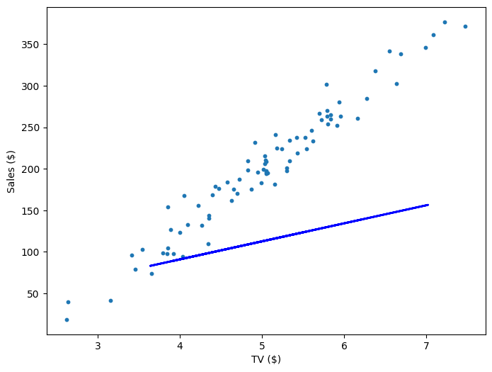
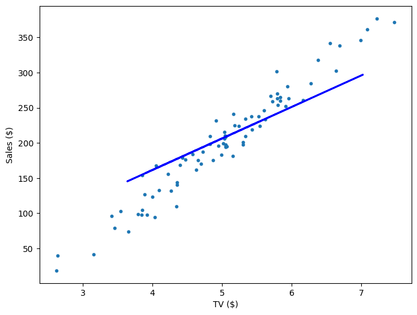
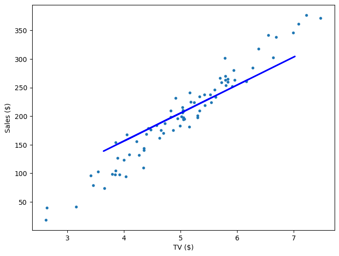
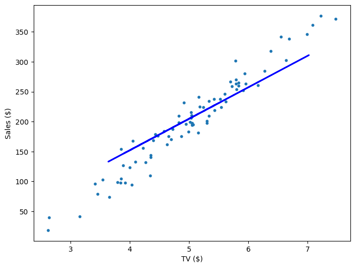
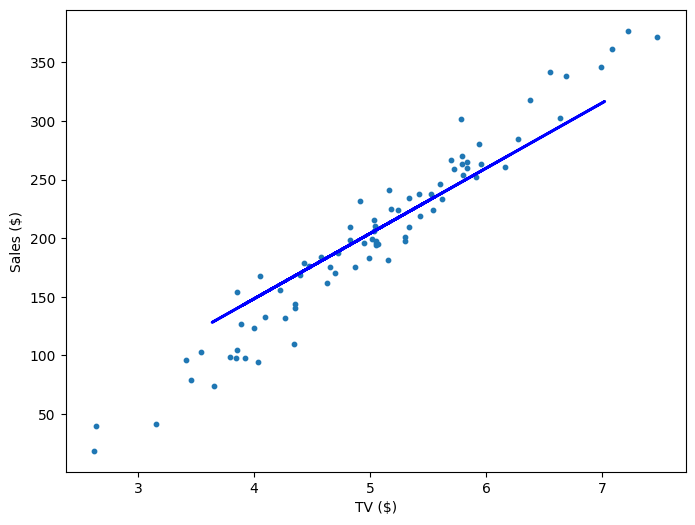

# Linear Regression

## What's the Problem?

Think you're good at marketing 🤔? No? Well, too bad. You're now the director of a major marketing firm and you're trying to develop an equation that will let you predict how many sales a company will make based on how much it spends on advertising. You currently have access to a dataset like this

| Company    | Social Media ($) | TV ($) | Billboards ($) | Sales ($) |
| ---------- | ---------------- | ------ | -------------- | --------- |
| Micro$oft  | 23.32            | 8.43   | 24.25          | 1367.71   |
| Adobe      | 15.82            | 4.15   | 26.94          | 508.51    |
| Fenty      | 24.99            | 10.04  | 20.51          | 785.73    |
| Chanel     | 25.99            | 23.32  | 13.52          | 1090.09   |
| Riot Games | 26.19            | 19.12  | 8.52           | 651.36    |

Since the data is continuous and you think the output has a constant slope, what you effectively want is a line of best fit. So, using our data, can we generate a function like this?

\\[
\text{Sales} = w_1 \text{Social Media} + w_2\text{TV} + w_3\text{Billboards}
\\]

## What is a Linear Regression?

A Linear Regression refers to a set of supervised learning algorithms which work out the coefficients for a linear combination of parameters, such that we minimise some cost function. This might sound like a broad statement, but that's because linear regression is a [huge topic](https://www.wikiwand.com/en/Linear_regression) with a lot of depth and alternative algorithms. But, for now, what we want is to optimise an equation like

\\[
\hat{y} = b +\sum_{i=1}^{n}w_ix_i
\\]

Where \\(\hat{y}\\) represents our ouput, and \\( w_i \\) represents the coefficient for the variable (feature) \\(x_i\\) we wish to factor into our equation. Often, these coefficients are called the **weights** of your model. As you can see, this means we have \\(n\\) variables in our equation, and \\( n \\) weights. But hold on, what's \\(b\\) 🤔? This is our bias term (sometimes just referred to as \\(w_0\\)), which just offsets all the predictions we make. If you think in terms of a line of best fit, this is just where our line intercepts the output axis.

We'll stick to this notation, but just so you're aware, there are many differing notations for the equation above.

\\[
\hat{y} = \beta_0 + \sum_{i=1}^{p}\beta_i x_i
\\]

\\[
h_\theta(\overrightarrow{x^{(i)}}) = \theta_0 + \sum_{z=1}^{n}\theta_z x_z^{(i)}
\\]

## Loss Function

But what are we optimising our weights for? What we need is a [cost function](https://pytorch.org/docs/stable/nn.html#loss-functions), which measures how bad our weights are at predicting the output of the training set. This is often also called a **loss function** or a **criterion**.

In our example, we'll use the [Mean Squared Error (MSE)](https://pytorch.org/docs/stable/generated/torch.nn.MSELoss.html#torch.nn.MSELoss) as our cost function. MSE measures the average of the square differences between the predicted value and the actual value. The output is just a single number representing the cost associated with our current weights. So, `lower = better` 🤓!

\\[
\text{MSE} = \frac{1}{N} \sum_{i=1}^{n}(y_i - \hat{y_i})^2
\\]

\\[
\text{MSE} = \frac{1}{N} \sum_{i=1}^{n}(\underset{\text{actual output for the ith data point}}{\underbrace{y_i}} - \underset{\text{predicted output for the ith data point}}{\underbrace{\hat{y_i}}})^2
\\]

Before we go any further, let's just recontextualise this in terms of our advertising example. We'll first only consider 1 variable, let's say TV Advertising, and we'll call it \\(x \\) just to keep things simple. Here \\(x_i \\) refers to the TV Advertising expenditure for the \\(ith \\) row on our table.

\\[
\text{Sales}_i = wx_i + b
\\]

We'll thus rewrite our loss function accordingly

\\[
\mathcal{L}(w, b) = \frac{1}{N}\sum_{i=1}^{n}(y_i - \text{Sales}_i)^2
\\]

\\[
\mathcal{L}(w, b) = \frac{1}{N}\sum_{i=1}^{n}(y_i - (wx_i + b))^2
\\]

## Gradient Descent

Okay, so we have a function (Sales) with parameters \\(w\\) and \\(b\\), and a loss/cost function, \\(\mathcal{L}\\) that measures how poorly our current choices of \\(w\\) and \\(b\\) predict the training data. To improve \\(w\\) and \\(b\\), or equivalently to minimise \\(\mathcal{L}\\), we'll use a technique called [Gradient Descent](https://www.youtube.com/watch?v=fXQXE96r4AY).

Gradient Descent is an iterative optimisation algorithm used to minimise the loss function. Here's how it works:

1. **Evaluate the Error:** Calculate the current error using the loss function \\(\mathcal{L}\\) with the current values of \\(w\\) and \\(b\\).
2. **Compute the Gradient:** Find the derivative of the loss function \\(\mathcal{L}\\) with respect to \\(w\\) and \\(b\\). This gives us the gradient, which indicates the direction of the steepest increase in the error.
3. **Update Parameters:** Adjust \\(w\\) and \\(b\\) by moving them in the direction opposite to the gradient. We move in the opposite direction because the gradient points to where the error increases, so moving the opposite way will help reduce the error.

By repeatedly applying these steps, we gradually adjust \\(w\\) and \\(b\\) to minimise the loss function \\(\mathcal{L}\\), thereby improving our linear regression.

A very common way to think about gradient descent is like a ball rolling down a mountain. Our loss function is some mountainous terrain, and the coordinates of its current position corresponds to the parameters of our model. We'd like to find the point on the mountain with the lowest elevation. So, what we'll do is look at the direction where the increase in elevation is steepest and push our ball in the opposite direction. If we keep doing this in small bursts, hopefully we'll find the point of lowest elevation, or at least low enough.

So how do we find the derivative of \\(\mathcal{L}\\) with respect to \\(w\\) and \\(b\\)? Since we need to consider \\(w\\) and \\(b\\) independently, we need to find their partial derivatives. We can find their partial derivatives by noticing that \\((y_i - (wx_i + b))^2\\) is really 2 nested functions: the inner function \\(y_i - (wx_i + b)\\) and the outer function \\(u^2\\). This means, we can just use the [Chain rule](https://tutorial.math.lamar.edu/classes/calci/chainrule.aspx) that you learnt in high school!

Returning to our loss function:

\\[
\mathcal{L}(w, b) = \frac{1}{N}\sum_{i=1}^{n}(y_i - (wx_i + b))^2
\\]

_Step 1_: Because the derivative of a sum is the sum of the derivatives, we can focus on finding the derivative of each \\((y_i - (wx_i + b))^2\\). So define \\(\mathcal{L}\_i\\):

\\[
\mathcal{L}_i(w, b) = (y_i - (wx_i + b))^2
\\]

_Step 2:_ Differentiate with respect to \\(w\\):

Using the chain rule, let \\(u = y_i - (wx_i + b)\\). Then \\(\mathcal{L}\_i (w, b) = u^2\\).

\\[
\frac{\partial \mathcal{L_i}}{\partial w} = \frac{\partial \mathcal{L_i}}{\partial u} \frac{\partial u}{\partial w}
\\]

First, compute \\(\frac{\partial \mathcal{L_i}}{\partial u}\\):

\\[
\frac{\partial \mathcal{L_i}}{\partial u} = 2u = 2(y_i - (wx_i + b))
\\]

Then, compute \\(\frac{\partial u}{\partial w}\\):

\\[
\frac{\partial u}{\partial w} = -x_i
\\]

Combine these results and simplify:

\\[
\frac{\partial \mathcal{L_i}}{\partial w} = 2(y_i - (wx_i + b)) \times -x_i
\\]

\\[
\frac{\partial \mathcal{L_i}}{\partial w} = -2x_i(y_i - (wx_i + b))
\\]

_Step 3:_ Differentiate with respect to \\(b\\):

Using the chain rule again, let \\(u = y_i - (wx_i + b)\\). Then \\(\mathcal{L}\_i (w, b) = u^2\\).

\\[
\frac{\partial \mathcal{L_i}}{\partial b} = \frac{\partial \mathcal{L_i}}{\partial u} \frac{\partial u}{\partial b}
\\]

First, compute \\(\frac{\partial \mathcal{L_i}}{\partial u}\\) (same as before):

\\[
\frac{\partial \mathcal{L_i}}{\partial u} = 2u = 2(y_i - (wx_i + b))
\\]

Then, compute \\(\frac{\partial u}{\partial b}\\):

\\[
\frac{\partial u}{\partial b} = -1
\\]

Combine these results and simplify:

\\[
\frac{\partial \mathcal{L_i}}{\partial b} = -2(y_i - (wx_i + b))
\\]

_Step 4_: We can now combine the sum of both of our results

\\[
\mathcal{L}' (w, b) = \begin{bmatrix}
\frac{1}{N} \sum_{i=1}^{n} \frac{\partial \mathcal{L_i}}{\partial w} \newline
\frac{1}{N} \sum_{i=1}^{n} \frac{\partial \mathcal{L_i}}{\partial b}
\end{bmatrix} = \begin{bmatrix}
\frac{1}{N} \sum_{i=1}^{n} -2x_i(y_i - (wx_i + b)) \newline
\frac{1}{N} \sum_{i=1}^{n} -2(y_i - (wx_i + b))
\end{bmatrix}
\\]

So, after calculating the gradient, we can then update our parameters \\(w \\) and \\(b \\).

\\[
w := w - \gamma \frac{\partial \mathcal{L}}{w}
\\]

\\[
b := w - \gamma \frac{\partial \mathcal{L}}{b}
\\]

But hold on, what's \\(\gamma\\) 🤔? This is our **learning rate**, and is an example of a **hyperparameter** (just like how many iterations we should train for). It essentially determines how much we should update our weights per iteration. Generally, you want this to be a very small value like `0.001`

Repeating this process is what we refer to as **training/fitting** our model. We go through the whole training dataset, calculate our error values, and then calculuate the gradient. We then use the gradient to update the weight and bias values by a small amount. Training is complete when our error reaches an acceptable level or when it starts to converge.

Before training, we generally initialise our weight and bias to just random values.

## Visualisation

If our model is working, then as we fit it to our training data, we should see it's weight and bias changing as the loss decreases.

| Iteration | Weight | Bias   | Loss     |
| --------- | ------ | ------ | -------- |
| 0         | 21.71  | 4.02   | 10545.35 |
| 200       | 44.82  | -17.81 | 918.33   |
| 400       | 49.01  | -39.64 | 757.99   |
| 600       | 52.61  | -58.45 | 639.32   |
| 800       | 55.72  | -74.65 | 551.53   |

## Multivariable Regression

Fortunately, the math doesn't actually get that much more complicated even as we add more variables (features). We just have to keep track of more partial derivatives, but the way we calculate those partial derivatives is the same! The trickiest thing actually is just keeping track of the notation. Here, \\(x_j^i \\) refers to the \\(jth \\) column and the \\(ith \\) row. In other words, it's the value of the \\(jth \\) variable for the \\(ith \\) data point. So, using all the columns in our table, our functions would just change accordingly:

\\[
\text{Sales} = w_1 \text{Social Media} + w_2\text{TV} + w_3\text{Billboards} + b = w_1x_1 + w_2x_2 + w_3x_3
\\]

\\[
\mathcal{L}(w_1, w_2, w_3, b) = \frac{1}{N}\sum_{i=1}^{n}(y_i - (w_1 x_1^i + w_2 x_2^i + w_3 x_3^i + b))^2
\\]

\\[
\mathcal{L}' (w_1, w_2, w_3, b) = \begin{bmatrix}
\frac{1}{N} \sum_{i=1}^{n} -2 x_1^i (y_i - (w_1 x_1^i + w_2 x_2^i + w_3 x_3^i + b)) \newline
\frac{1}{N} \sum_{i=1}^{n} -2 x_2^i (y_i - (w_1 x_1^i + w_2 x_2^i + w_3 x_3^i + b)) \newline
\frac{1}{N} \sum_{i=1}^{n} -2 x_3^i (y_i - (w_1 x_1^i + w_2 x_2^i + w_3 x_3^i + b)) \newline
\frac{1}{N} \sum_{i=1}^{n} -2 (y_i - (w_1 x_1^i + w_2 x_2^i + w_3 x_3^i + b))
\end{bmatrix}
\\]

And that's it! Multivariable linear regression. You can see our functions get a little hard to parse though as we add more variables, so very often we'll simplify things with matrices. We construct a column vector \\(\text{errors} = \text{targets} - \text{predictions}\\), where the \\(ith\\) row is the result \\(y_i - \hat{y_i}\\), and we have an \\(m \times n\\) feature matrix \\(X\\) that contains our \\(n\\) data points for our \\(m\\) variables.

\\[
\mathcal{L}' = \frac{-2}{N}X(\text{targets} - \text{predictions})
\\]

So, for our example, if we had only 3 data points, the above equation might look like this:

\\[
\mathcal{L}' = \frac{-2}{3}
\begin{bmatrix}
x_1^1 & x_1^2 & x_1^3 \newline
x_2^1 & x_2^2 & x_2^3 \newline
x_3^1 & x_3^2 & x_3^3 \newline
1 & 1 & 1 \newline
\end{bmatrix}
\begin{bmatrix}
y_1 - \hat{y_1} \newline
y_2 - \hat{y_2} \newline
y_3 - \hat{y_3} \newline
\end{bmatrix}
\\]

Notice that to account for \\(b\\), our feature matrix just has a row of ones. It's for that reason that very often we will just treat bias as a constant feature with weight \\(w_0\\).

## Exercises

FILL HERE

## Extra Reading: Deterministic Linear Regressions

- Pseudoinverse
- Normals

## Extra Reading: Exploding and Vanishing Gradients

Fill Here
