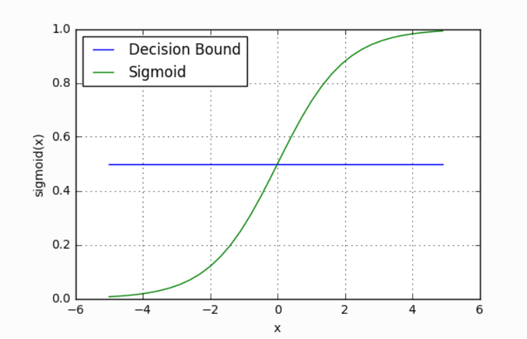
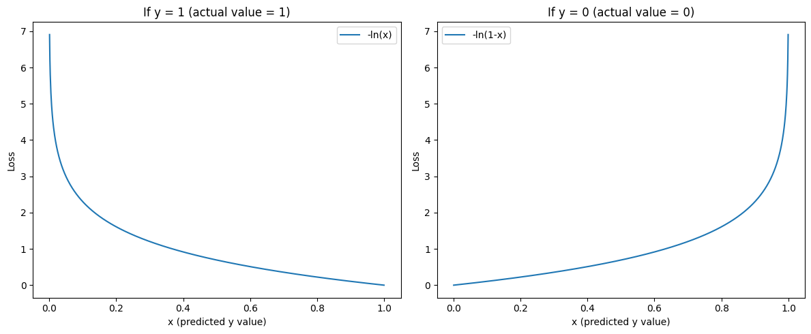

# Logistic Regression

## What's the Problem?

The Academic Performance Team at your local university is trying to develop the perfect predictor for whether a student will pass or fail a unit based on various metrics they have access to. Because they've heard you're a talented (and cheap) data scientist, they've enlisted your help! You currently have access to a dataset like this

| Name     | Hours Studied | Forum Engagement | Hours Doomscrolling | Pass/Fail |
| -------- | ------------- | ---------------- | ------------------- | --------- |
| Michelle | 12.3          | 8.9              | 0.1                 | P         |
| John     | 8.8           | 9.2              | 5.1                 | P         |
| Will     | 6.5           | 2.1              | 2.0                 | F         |
| Colin    | 9.4           | 0.3              | 3.1                 | P         |
| Bella    | 2.2           | 0.1              | 14.3                | F         |

Now, you already know [K-Nearest Neighbours](./machine-learning/knn.md) is a classification algorithm you could try using. However, there's likely some linear relationships in the data here (e.g., more hours studied = higher grade; more hours doomscrolling = lower grade). So, could we combine some of the techniques we learned for [linear regression](./machine-learning/linear_regression.md) to create a pass/fail predictor?

## What is a Logistic Regression

A logistic regression is a model that estimates the probability of an event as a linear combination of one or more variables. There's two types of logistic regression: binary (pass/fail) and multi (HD/D/C/P/F). To keep things simple, let's only focus on binary logistic regression for now.

So, we have three features (Hours Studied, Forum Engagement, Hours Doomscrolling) and two classes (passed, failed). What we want is the output of a linear regression to somehow be a probability that the student passed. So, the output is any real value between 0 and 1, with 0 representing a fail and 1 a pass. To do this, we'll just feed the output of a regular linear regression into a [sigmoid function](https://www.wikiwand.com/en/Sigmoid_function):

\\[
S: \mathbb{R }\to (0, 1), S(x) = \frac{1}{1 + e^{-x}}
\\]

\\[
S(x) = \frac{1}{1 + e^{-w_1\text{Hours Studied} + w_2\text{Forum Engagement} + w_3\text{Hours Doomscrolling} + b}}
\\]

This maps any real value into a value between 0 and 1 and is what we often use in machine learning to map predictions to probabilities. It is an example of a [logistic function](https://www.wikiwand.com/en/Logistic_function). In machine learning, the raw inputs into this function are often called **logits**, but note that this is completely different from the [mathematical definition](https://stackoverflow.com/questions/41455101/what-is-the-meaning-of-the-word-logits-in-tensorflow) 😖.

## Making Predictions

Our current model returns a probability score between 0 and 1, but we wanted it to map to a discrete class (Passed/Failed). To do this, we select a threshold value above which we classify a student as passed, and below which we classify a student as failed. For example, if our threshold was 0.5 and our probability was 0.2, we would classify the student as failed.

The nice thing is that we can tune this threshold to our liking depending on our usecase. For instance, for a preliminary medical screening for cancer, it might be a good idea to have a lower threshold because we'd rather have more false positives than miss a potential victim.

## Loss Function & Training

Because all the parameters of our model are inside the linear regression function, we can just use the same training approach as we did for that model. That is, we'll use gradient descent to iteratively tune the weights and bias of our model.

Unfortunately, we shouldn't use the same loss function (Mean Squared Error) as we did for linear regression. Why? If you're inclined, there's a great written explanation by [Michael Nielson](http://neuralnetworksanddeeplearning.com/chap3.html) on how the gradients decrease for increasingly worse predictions and a great video proof by [Christian Nabert](https://www.youtube.com/watch?v=m0ZeT1EWjjI) for it being non-convex. But, intuitively, MSE just doesn't punish our model enough for bad predictions.

Instead, we'll use [Binary Cross-Entropy](https://pytorch.org/docs/stable/generated/torch.nn.BCELoss.html) loss, also known as negative log loss.

$
\mathcal{L} = \frac{-1}{N} \sum_{i=1}^{n}y_i\ln{(\hat{y_i})} + (1-y_i)\ln{(1-\hat{y_i})}
$

It might look a little confusing, but it's actually a very intuitive cost function. We can break it up into 2 cases, when our actual label ($y_i$) is 1 and when it's 0.

$
\mathcal{L} = \ln{(\hat{y_i})} \hspace{2.6cm} \text{if y = 1}
$

$
\mathcal{L} = \ln{(1 - \hat{y_i})} \hspace{2cm} \text{if y = 0}
$

As you can see, our loss function is minimal when the prediction is correct, and it heavily penalises incorrect predictions.

Multiplying by $y$ and $(1-y)$ in the general equation is just a neat way of combining the two functions into one equation, and just like MSE loss we take the average loss for all data points in our training dataset.

## Gradient Descent

One of the really neat things about Binary Cross-Entropy loss is that the expression for its gradients with respect to the weights and bias are quite simple. I won't cover them here since they're a bit involved, but [Nielson](http://neuralnetworksanddeeplearning.com/chap3.html) covers them and so does this [stackexchange](https://math.stackexchange.com/questions/2503428/derivative-of-binary-cross-entropy-why-are-my-signs-not-right) (_note:_ the author does not take the mean of the loss here like we do).

$
\mathcal{L}' (w, b) = \begin{bmatrix}
\frac{\partial \mathcal{L}}{\partial w} \newline
\frac{\partial \mathcal{L}}{\partial b}
\end{bmatrix} = \begin{bmatrix}
\frac{1}{N} \sum_{i=1}^{n} x_i(\hat{y_i} - y_i) \newline
\frac{1}{N} \sum_{i=1}^{n} (\hat{y_i} - y_i)
\end{bmatrix}
$

## Exercises

Your task is to implement a Logistic Regression model. You must implement `_sigmoid()` which applies the sigmoid function piecewise to a vector, `fit()` which adjusts the weights and bias of your model to some training data, `predict()` which returns the predicted values of of an array of data points.

**Inputs** - `_sigmoid()`:

- `x` is a NumPy NDArray (vector) of values such as `[1, 2, 3, 4]`, to which you should apply the sigmoid function in a piecewise fashion, returning, for example, `[0.73105858 0.88079708 0.95257413 0.98201379]`.

**Inputs** - `fit()`:

- `X` is a NumPy NDArray (matrix) of data points such as `[[1, 1, 0], [0, 0.5, 3], [0.7, 0.9, 0.3]]`, representing the training data (e.g., a set of coordinates [Hours studied, Forum engagement, Hours doomscrolling] for numerous students).
- `y` is a NumPy NDArray (vector) of values such as `[0, 1, 0]`, representing the corresponding binary class for each data point (e.g., whether the student has passed or failed the unit).

**Inputs** - `predict()`:

- `X` is a NumPy NDArray (matrix) of data points such as `[[1, 1, 0], [0, 0.5, 3], [0.7, 0.9, 0.3]]`, representing a set of points we want to predict a binary class for (e.g., a list of various students' metrics from which we want to predict whether they pass or fail).

**Bonus**: You might notice that there is a lot of repeated code between your Linear Regression and Logistic Regression classes. While I might think that's fine, an OOP purist would promptly send you to the gallows. So, see if you can try to combine some of the functionality into a parent class or abstract class.
