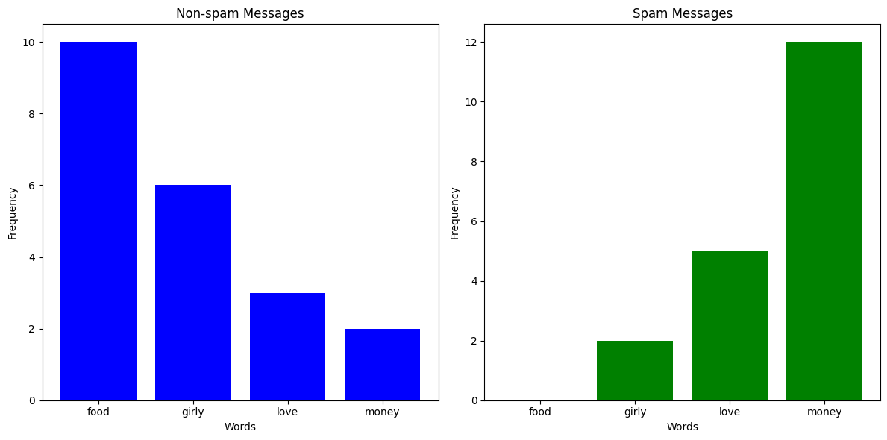
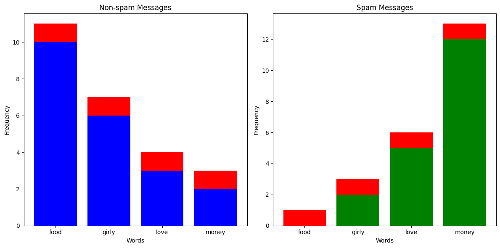

# Naive Bayes Classifier

## What's the Problem?

You've been getting a lot more spam bots texting you lately, and instead of blocking them manually, you've decided to build a classifier which can automatically predict whether a message is spam or not. You've noticed that messages from spam bots tend to have different vocabulary compared to what your friends send you, so you take a sample of messages and plot how many times certain words appear.

Clearly, if some words appear more than others, it is more likely that the message is from a spam bot. So, could we build a probabilistic classifier around that?

## What is a Naive Bayes Classifier?

The idea behind Naives Bayes Classifiers is actually quite simple. Let's say we had \\(K\\) classes and \\(n\\) features, then if we assigned probabilities \\(p(C_k | x_1, ..., x_n)\\) to each class \\(C_k\\) given we have some feature vector \\(\textbf{x} = (x_1, ..., x_n)\\), then the model's best prediction would just be the class with the highest probablitiy.

For example, let's say we got a text with 4 occurences of the word "food", 2 occurences of the word "girly", 6 occurences of the word "love", and 0 occurrences of the word "money". We could represent that text as a vector \\(\textbf{x} = (4, 2, 6, 0)\\). Now, let's say that \\(p(\text{Spam Message} | \textbf{x}) = 0.19\\) and \\(p(\text{Non-spam Message} | \textbf{x}) = 0.6\\), then we would confidently say that the message is not spam.

The problem is how do we work out \\(p(C_k | \textbf{x})\\)? Fortunately, [Bayes' Theorem](https://www.wikiwand.com/en/Bayes'_theorem) comes to the rescue, because it tells us the conditional probabilitiy can be expressed as

\\[
p(C_k | \textbf{x}) = \frac{p(C_k) p(\textbf{x} | C_k)}{p(\textbf{x})}
\\]

Often in Bayesian probability, the above equation will also be phrased as follows

\\[
\text{posterior} = \frac{\text{prior} \times \text{likelihood}}{\text{evidence}}
\\]

We notice that for all \\(C_k\\), the denominator \\(p(\textbf{x})\\) doesn't change, so it's effectively a constant. Since we don't really care about the actual probability values but rather the predictions, we can just get rid of it for now to simplify our equations.

\\[
p(C_k | \textbf{x}) \propto p(C_k) p(\textbf{x} | C_k)
\\]

> \\(\propto\\) is the "proportional to" symbol, since strictly speaking the terms aren't equal

Now, by using the [chain rule](https://www.youtube.com/watch?v=v8Uw1TFl2WQ) repeatedly and by assuming that each of the features of \\(\textbf{x}\\) are independent (see [here](https://www.youtube.com/watch?v=dNhdefN36E4) for details), we can get the following expression

\\[
p(C_k | \textbf{x}) \propto p(C_k)\prod_{i=1}^{n}p(x_i|C_k)
\\]

That means, with some feature vector \\(\textbf{x}\\), our prediction \\(\hat{y}\\) will be

\\[
\hat{y} = \underset{k \in \left\{ 0, ..., K \right\}}{\text{argmax}} p(C_k)\prod_{i=1}^{n}p(x_i|C_k)
\\]

Sometimes, however, some probabilities will be so small that the actual numbers risk underflowing on a computer, causing weird undefined behaviour. For that reason, some models will just take the log probability of everything.

\\[
\hat{y} = \underset{k \in \left\{ 0, ..., K \right\}}{\text{argmax}} \log{(p(C_k))} + \sum_{i=1}^{n} \log{(p(x_i|C_k))}
\\]

## Types of Naive Bayes Classifier

There are many different types of Naive Bayes Classifiers depending on what sort of probability distributions the feature variables are sampled from.

- **Bernoulli Naive Bayes**: This is used with vectors with Boolean variables, such as \\(\textbf{x} = (1, 1, 0, 0, 1)\\).
- **Multinomial Naive Bayes**: This is used with features from multinomial distributions. This is especially useful for non-negative discrete data, such as frequency counts. The above examples of counting words in a text message are a good example of this. Here, if the probability of seeing the word in a text message given a certain class is \\(p_k\\), the likelihood of it appearing \\(c\\) times would be \\(p_k^c\\).
- **Gaussian Naive Bayes**: This is used with Gaussian/normal distributions. Typically when our feature variables are continuous, we assume that they're sampled from a gaussian distribution, and we thus calculate the likelihood \\(p(x_i | C_k)\\) as follows

\\[
p(x_i | C_k) = \frac{1}{\sqrt{2 \pi \sigma_k^2}}e^{-\frac{(x_i - \mu_k)^2}{2 \sigma_k^2}}
\\]

> - \\(\sigma_k^2\\) is the variance of \\(x_i\\) associated with the class \\(C_k\\)
> - \\(\mu_k\\) is the mean of \\(x_i\\) associated with the class \\(C_k\\)

## Alpha Value

Let's say you've received a text message with 20 occurrences of the word "money" and 1 occurrence of the word "food". Just looking at the column chart above, you'd expect that the text message would be labelled as spam. But since there aren't any spam messages in the training data with the word "food", the likelihood of having 1 occurrence in a spam message is 0, meaning \\(p(\text{Spam Message} | (1, 0, 0, 20)) = 0\\). This is clearly a problem, so what we do is something called [Laplace smoothing](https://datascience.stackexchange.com/questions/30473/how-does-the-mutlinomial-bayess-alpha-parameter-affects-the-text-classificati). Effectively, we add an \\(\alpha\\) to all the occurences of everything in our training set to avoid multiplying anything by 0.

## Exercise

### Multinomial Classifier

Your task is to implement a Multinomial Naive Bayes Classifier. You must implement `fit()` which takes training data and preprocesses it for predictions, and `_predict()` which returns the predicted class for a given feature vector. You should account for an \\(\alpha\\) value, but you should **not** use \\(\log\\) probabilities.

**Inputs** - `fit()`:

- `X` is a NumPy NDArray (matrix) of feature vectors sampled from a multinomial distribution that form your training data. For example, `[[1, 1, 0, 1], [2, 3, 4, 1], [3, 4, 2, 1]]`. In context of the spam filter, you could imagine each inner as a counter for a text message, with each number representing the occurences of a certain word.
- `y` is a NumPy NDArray (vector) representing the classes of each feature vector of `X`. For example, `[0, 0, 1]`. In context of the spam filter, you could imagine each number corresponding to a True/False of whether each corresponding text message is spam.
- `alpha` is a non-negative integer representing the Laplace smoothing parameter. This represents how much you should add to each feature count per class for calculating likelihood.

**Inputs** - `_predict()`:

- `x` is a NumPy NDArray (vector) representing a feature vector sampled from a multinomial distribution which you should predict the class of from the training data. For example, `[1, 2, 0, 1]`.

### Gaussian Classifier

Your task is to implement a Gaussian Naive Bayes Classifier. You must implement `fit()` which takes training data and preprocesses it for predictions, and `_predict()` which returns the predicted class for a given feature vector. You do not need to account for an \\(\alpha\\) value, but you **should** use \\(\log\\) probabilities.

**Inputs** - `fit()`:

- `X` is a NumPy NDArray (matrix) of feature vectors with continuous values that form your training data. For example, `[[23.4, 11.2, 1.2], [4.3, 5.6, 1.2], [3.3, 2.2, 14.2]]`. For some context, you could imagine each inner array as some summary of a customer, and each value as the average number of minutes spent in certain stores.
- `y` is a NumPy NDArray (vector) representing the classes of each feature vector of `X`. For example, `[2, 0, 1]`. In the same context, these labels could refer to whether the customer is "non-binary, male, female".

**Inputs** - `_predict()`:

- `x` is a NumPy NDArray (vector) representing a feature vector with continuous values which you should predict the class of from the training data. For example, `[1.2, 1.1, 6.3]`.

## Extra Reading: Why is it called naive?

⚠️ In Progress ⚠️
