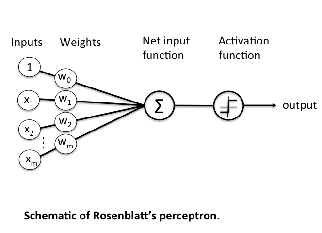
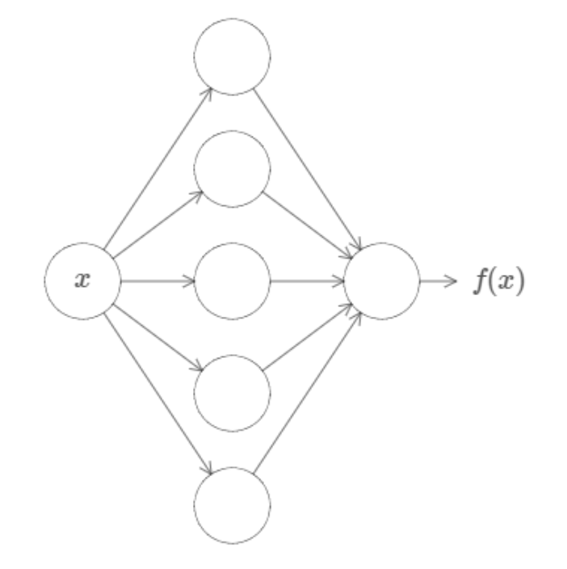
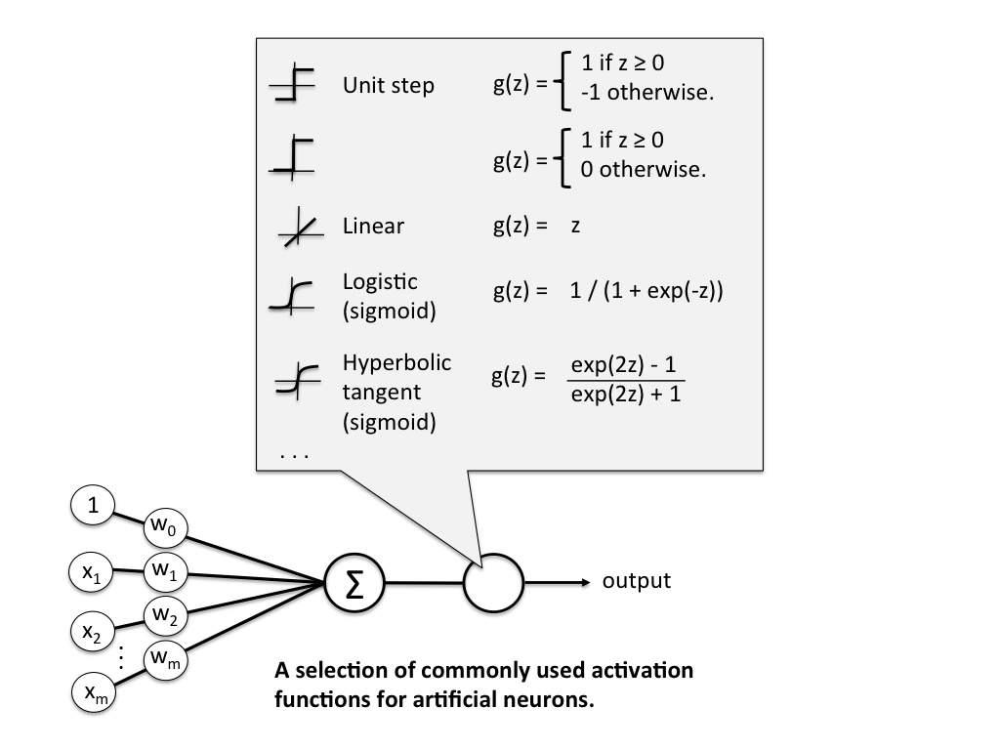

# Perceptron

## It’s Nothing New!

So far, you’ve actually come across all the ingredients for building a neural network: [linear regression, loss functions, gradient descent](./linear_regression.md), [activation functions](./logistic_regression.md). But, if you went ahead and read a Deep Learning paper, you’d probably find yourself unfamiliar with a lot of the terminology. This is mostly because the field has a lot of its own vocabulary and they tend to misuse and relabel their own terms and terms from other branches of mathematics. So, in this article we’re going to cover some history and revisit all of these concepts but in the context of the “perceptron”, the core unit of neural networks. In doing so, hopefully you’ll be less confused in future and will have a greater appreciation for the field’s history.

## The McCulloch-Pitts Model

The initial model for the perceptron dates back to Warren McCulloch (neuroscientist) and Walter Pitts (logician) in 1943. They described biological neurons as subunits of a neural network in the brain. Signals of variable magnitude arrive at the dendrites, they accumulate in the cell body, and if they exceed a certain threshold, they pass onto the next neuron.

The two scientists simplified this into a Boolean model called a perceptron, something which takes in a bunch of `True/False` values, counts them, and returns `True/False` depending on if the count meets some threshold.

For instance, here \\(g\\) takes in the input Booleans \\(x_1, …, x_n\\), aggregates them, and then \\(f\\) decides whether to output a `True` or `False`.

So, for example

- \\(x_1\\) could be the question "Have I Eaten?"
- \\(x_2\\) could be "Is it Evening?"
- \\(x_3\\) could be "Is that girl texting me?"
- \\(x_4\\) could be "Is work due tomorrow?"

And \\(y\\) could be the result "Will I be happy tonight?". \\(f\\) then might specify that if at least 3 of these are true, then \\(y\\) is true. More formerly, we'd express the model like this where \\(\theta\\) is our activation threshold (3):

\\[
g(x_1, x_2, x_3, ..., x_n) = g(\textbf{x}) = \sum_{i=1}^{n} x_i
\\]

\\[
y = f(g(\textbf{x})) = \begin{cases}
1 & \text{if } g(\textbf{x}) \geq \theta \newline
0 & \text{otherwise}
\end{cases}
\\]

McCulloch and Pitts demonstrated that this model could be used to represent AND, OR, NOT, NAND, and NOR gates, and they also showed that they admit a nice geometric interpretation. If we draw up the input variables \\(x_1, ..., x_n\\) on their own axes, then our \\(\theta\\) value admits a decision boundary in the space.

So, for 2 input variables there are only 4 possible combinations for the input - (0, 0), (0, 1), (1, 0), (1, 1). If we set \\(\theta = 1\\), then we effectively create an OR gate, and geometrically, our perceptron will return 1 if our input lies **above** the decision boundary, and 0 if it lies **below**.

What do you think will happen if we change the \\(\theta\\) value?

Beautifully, this model extends to higher dimensions just as easily. So, in 3D, our decision boundary just becomes a plane instead of a line.

## The Rosenblatt Artificial Neuron

Some big problems with the McCulloch-Pitts model are that it required us to handcode the \\(\theta\\) threshold and that all of our inputs contributed to the result equally. In 1957 Frank Rosenblatt would solve these by introducing the idea of _learnable weights_.

Instead of restricting our inputs to boolean variables, we'd allow any real number and just multiply each by a _weight_ parameter. We'd aggregrate these products like in the McCulloch-Pitts model and only return a 0 or 1 depending on if it meets a certain threshold.

More formerly, we define \\(\textbf{z}\\) to be the linear combination of input values \\(\textbf{x}\\) and weights \\(\textbf{w}\\), which we pass through an _activation function_ \\(g(\textbf{z})\\) that enforces our threshold.

Mathematically, \\(g(\textbf{z})\\) is the "unit step function" or "heaviside step function" and can be defined as

\\[
g(\textbf{z}) = \begin{cases}
1 & \text{if } \textbf{z} \geq \theta \newline
0 & \text{otherwise}
\end{cases}
\\]

where

\\[
\textbf{z} = x_1 w_1 + ... + x_n w_n = \sum_{i=1}^{n} x_i w_i = \textbf{x}^T \textbf{w}
\\]

\\(\textbf{w}\\) is the weight vector, and \\(\textbf{x}\\) is an \\(n\\)-dimensional sample from some training data.

\\[
\textbf{x} = \begin{bmatrix}
x_1 \newline
\vdots \newline
x_n
\end{bmatrix} \quad \textbf{w} = \begin{bmatrix}
w_1 \newline
\vdots \newline
w_n
\end{bmatrix}
\\]

The problem is that we still have a \\(\theta\\) value we need to hardcode. To fix that, we just need to realise that having a \\(\theta\\) threshold is just the same as adding \\(\theta\\) to our linear combination, adding a **bias** to our result. We can then just treat this as another weight we need to learn, \\(w_0\\), with a constant input of \\(x_0 = 1\\). This simplifies our activation function to

\\[
g(\textbf{z}) = \begin{cases}
1 & \text{if } \textbf{z} \geq 0 \newline
0 & \text{otherwise}
\end{cases}
\\]

## Rosenblatt's Learning Model

The learning rules for Rosenblatt's artifical neuron are actually quite simple.

1. Initialise the weights to small random numbers
2. For each training sample \\(\textbf{x}^i\\):
   1. Calculate the output, \\(\hat{y_i}\\)
   2. Update **all** the weights.

The output \\(\hat{y_i}\\) is the `True/False` value (class label) from earlier (0 or 1), and each weight update can be written formerly as

\\[
w_j := w_j + \alpha \Delta w_j
\\]

where \\(\alpha\\) is the learning rate, a value in \\([0, 1]\\)

The value for calculating \\(\Delta w_j\\) is also quite simple

\\[
\Delta w_j = x_j^i(y_i - \hat{y_i})
\\]

> - \\(w_j\\) = the \\(jth\\) weight parameter
> - \\(x_j^i\\) = the \\(jth\\) value of the \\(ith\\) \\(\textbf{x}\\) vector in our training dataset.
> - \\(y_i\\) = the actual class label (0 or 1) for the \\(ith\\) training point.
> - \\(\hat{y_i}\\) = the predicted class label (0 or 1) for the $ith$ training point.

Although the notation might seem a bit awful, the logic behind this rule really is quite beautifully simple. Let's have a look at what possible values we might get.

\\[
\begin{matrix}
y_i & \hat{y_i} & y_i - \hat{y_i} \newline
1 & 1 & 0 \newline
1 & 0 & 1 \newline
0 & 0 & 0 \newline
0 & 1 & -1 \newline
\end{matrix}
\\]

We can see that the weights are pushed towards negative or positive target classes depending on how the prediction is wrong! By multiplying this with \\(x_j^i\\), we change weights proportionally to how much they affected the end result.

Again, it's important to note that we update **all** the weights per training sample. A complete run over all the training samples is called an **epoch**. We can then train for an arbitrary amount of epochs or until we reach some accuracy.

## Adapative Linear Neuron (ADALINE)

A problem with Rosenblatt's model though is that it doesn't account for how wrong the model's predictions are when updating the weights. To account for that, in 1960 Bernard Widrow and Tedd Hoff created the [Adaptive Linear Neuron (ADALINE)](https://www.wikiwand.com/en/ADALINE).

In contrast to the Rosenblatt model, the activation function is just the identity function (do nothing), and only when we need to make a prediction do we put it into the unit step function (quantizer). **NOTE**: often the identity function will be referred to as a "linear activation function", since the aggregator is a linear combination of inputs.

While this might seem like a step back, the big advantage of the linear activation function is that it's differentiable, so we can define a loss/cost function, \\(\mathcal{L}(\textbf{w})\\) that we can minimise to update our weights. In this case, we'll define our loss function to be the mean squared error.

\\[
\mathcal{L}(\textbf{w}) = \frac{1}{n}\sum_{i=1}^{n}(y_i - \hat{y_i})^2
\\]

We can minimise this loss function using gradient descent, giving us a new update rule for our weights.

\\[
\mathcal{L}' = \frac{-2}{n} X (\textbf{y} - \hat{\textbf{y}})
\\]

\\[
\textbf{w} := \textbf{w} + \alpha \Delta \textbf{w}
\\]

There are 2 key differences to the Rosenblatt model that you should notice here

1. \\(\hat{\textbf{y}}\\) is a vector of real numbers, not class labels. These are the raw predictions that come from the linear combination of weights. Often these will be called "logits". Because these can vary a lot in magnitude, it's important to apply **feature scaling** in your model.
2. The weights are updated based on **all** samples in the training set at once (instead of updating incrementally after each sample).

## Non-Linear Activation Functions

The remaining problem with ADALINE is that it was still effectively just separating some space with a linear decision boundary. Even if we combined multiple perceptrons together, it could still be simplified down to just one single neuron and one single decision boundary. Not all data, however, can be separated with just a straight line, plane, or hyperplane.

In 1989 this was solved by [George Cybenko](https://link.springer.com/article/10.1007/BF02551274), who demonstrated that we can model non-linear datasets by setting our activation function to the **sigmoid function**:

In fact, Cybenko demonstrated something much stronger than that. He showed that if we combined such neurons into a "neural network" (with even just one layer), then we could approximate any continuous function to any desired precision.

So, I could give you any function, like some random squiggle:

And there is **guaranteed** to exist a network of neurons that could could approximate this function to some arbitrary precision.

While that might not make a lot of sense now, this is a profound result and is the first of the [Universal Approximation Theorems](https://www.wikiwand.com/en/Universal_approximation_theorem), which underpin a lot of the theory behind deep learning today. You can find links to the official proofs on the Wikipedia page (even for other activation functions!) but if you want just an intuition for the proof, I highly reccommend either this [video](https://www.youtube.com/watch?v=Ijqkc7OLenI) or [article](http://neuralnetworksanddeeplearning.com/chap4.html) by Nielsen.

The main thing to know is that this is essentially the modern blueprint for the artifical neuron which makes up the neural networks which power so much of AI today. Although there is technically a distinction between "perceptron" and "artifical neuron", most people will just use both terms to refer to this.

## Exercise

Your task is to implement the Rosenblatt perceptron. You must implement `fit()` which adjusts the weights and bias of your model to some training data an `predict()` which returns the predicted values of of an array of data points.

**Inputs** - `fit()`:

- `X` is a NumPy NDArray (matrix) of data points such as `[[1, 1, 0], [0, 0.5, 3], [0.7, 0.9, 0.3]]`, representing the training data.
- `y` is a NumPy NDArray (vector) of values such as `[0, 1, 0]`, representing the corresponding binary class for each data point.

**Inputs** - `predict()`:

- `X` is a NumPy NDArray (matrix) of data points such as `[[1, 1, 0], [0, 0.5, 3], [0.7, 0.9, 0.3]]`, representing a set of points we want to predict a binary class for. So, you should return a NumPy NDArray (vector) like `[0, 0, 1]`.

**Note:** The Rosenblatt Perceptron is pretty much found nowhere today, but it's still a good exercise to implement, and you should see a lot of similarities between this and your implementations of [Linear Regression](./linear_regression.md) and [Logistic Regression](./logistic_regression.md).

## Why Don't We Just Study Deep Learning Now?

Great! You've just learned the core unit for neural networks. You might be wondering why we don't just dive right in and study neural networks and deep learning now. Especially with all the hype around LLMs and GNNs, it can seem like classical ML algorithms are ancient and obsolete.

However, this couldn't be further from the truth. In fact, classical ML is still used extensively and here are just some of the advantages:

- **Explainability:** Neural Networks can be near impossible to justify, because often the values for weights and biases don't correspond to any logic we'd understand. Conversely, classical ML models are easy to visualise and have human explainable parameters.
- **Speed:** While in theory neural networks can approximate any function, they often need a lot of perceptrons and, by extension, a lot of parameters to do so. Because of that, they can take a long time to train and can be too memory intensive to even run on some devices. Conversely, classical ML algorithms are generally more efficient and boast plenty of room for optimisation (especially with easy parallelisation!).
- **Superior Performance:** On some datasets, classical ML algorithms can perform the same or even better than most deep learning techniques. There's a great [paper](https://arxiv.org/abs/2207.08815#) demonstrating this with a good summary on [Medium](https://medium.com/geekculture/why-tree-based-models-beat-deep-learning-on-tabular-data-fcad692b1456)

So, whenever you need to solve a new problem here's the thought process you should take:

1. Is there a deterministic algorithm I can use to solve this?
2. Could I use some classical ML algorithms to help me solve this?
3. Did I really consider all my options?
4. _sigh_, how can I use Deep Learning to help me solve this?

I'll end with this [Tweet](https://x.com/LukeGessler/status/1679211291292889100) which depicts how this [paper](https://aclanthology.org/2023.findings-acl.426/) from 2023 demonstrated that [KNN](./knn.md) - yes, the very first algorithm you learnt! - outperformed deep neueral networks with millions of parameters.

## Extra Reading: Variants of Gradient Descent

One of the important differences for ADALINE compared to the Rosenblatt model was that it updated the weights based on _all_ training samples at once, rather than updating them incrementally for each sample. In formal terms, we describe ADALINE's learning method as **vanilla gradient descent**. In contrast, since the parameters of the Rosenblatt model change more frequently, we call it **stochastic gradient descent**.

There are positives and negatives to both of these methods. For instance, vanilla gradient descent guarantees convergence to some local minimum of the loss function, but it is usually slow and painful. Stochastic gradient descent performs more frequent updates so it can often converge fasters, but it can also result in more oscillations.

A nice compromise between the both of these is **mini-batch gradient descent**, which updates the parameters of your model after seeing a set amount of training samples (a batch).

But there are plenty more variants of gradient descent, and we call each of these algorithms "optimisers". Often, you'll see `Adam` and `SGD` being used in most deep learning projects, because they empirically perform the best on the widest range of data. But if you want a really good comparison between current optimisers, I highly reccommend this [review paper](https://arxiv.org/abs/1609.04747?ref=ruder.io).

**Note:** People will often use SGD (stochastic gradient descent) to describe vanilla gradient descent, mini-batch gradient descent, and many other variants which introduce momentum. While admittedly a bad trend, it's made its way into most machine learning libraries, so we'll often use these terms interchangeably too from here on out.
