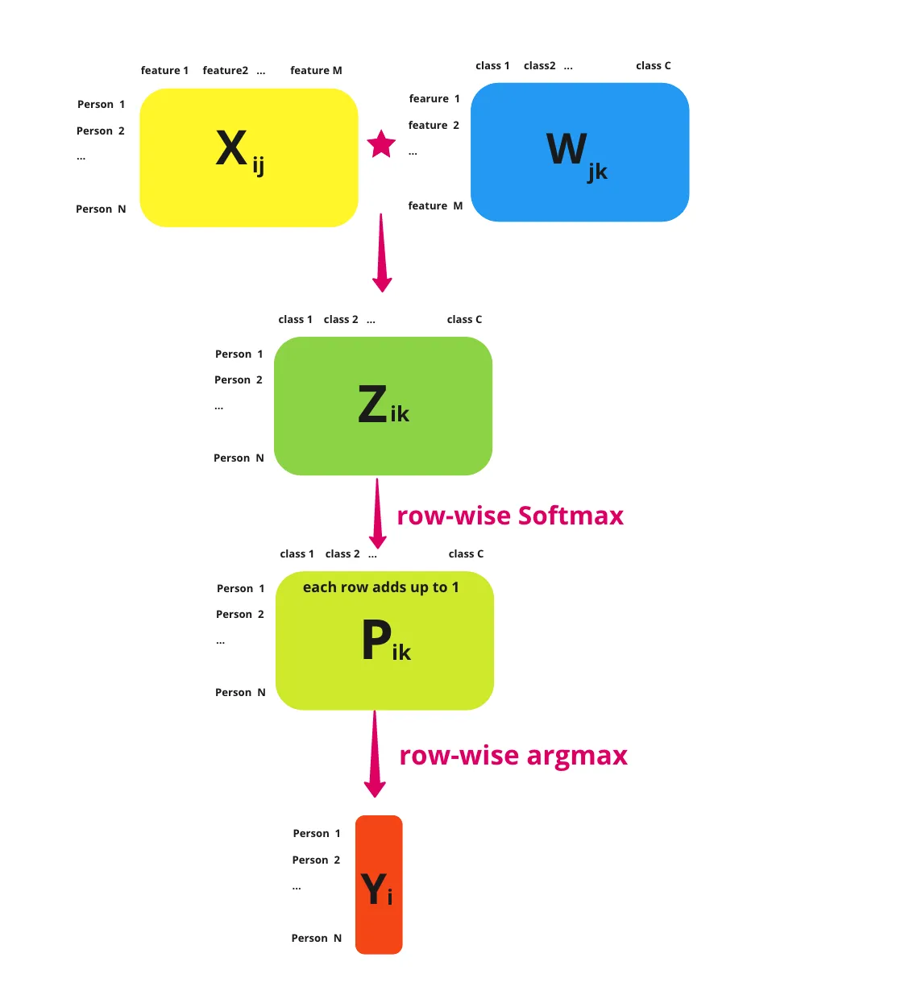

# Softmax Regression

## What's the Problem?

The Academic Performance Team at your local university would like to extend the pass/fail predictor you made to predict the grade the student will receive (HD/D/C/P/F).

| Name     | Hours Studied | Forum Engagement | Hours Doomscrolling | Grade |
| -------- | ------------- | ---------------- | ------------------- | ----- |
| Michelle | 12.3          | 8.9              | 0.1                 | HD    |
| John     | 8.8           | 9.2              | 5.1                 | D     |
| Will     | 6.5           | 2.1              | 2.0                 | F     |
| Colin    | 9.4           | 0.3              | 3.1                 | C     |
| Bella    | 2.2           | 0.1              | 14.3                | F     |

Is there some way you could extend the [binary logistic regression classifier](logistic_regression.md) you made earlier to support multiple classes?

## What is a Softmax Regression

A softmax regression is a generalisation of the [logistic regression](logistic_regression.md) which supports the estimation of the probabilitity of multiple events. Luckily not much changes between the two models, but there are some key differences.

Firstly, because we're calculating the probability of multiple classes, we now need to provide logits for each class. So, for each data point we pass into the linear part of our model, we should return a vector like this, with a row for each class.

\\[
\bold{z} = \begin{bmatrix}
1.3 \newline
5.1 \newline
2.2 \newline
0.7 \newline
1.1 \newline
\end{bmatrix} \in \mathbb{R}
\\]

This means that our weights matrix, $W$, needs to be extended. So instead of just being \\(\text{features} \times 1\\) like it was for logistic regression, it now needs to be \\(\text{features} \times \text{classes}\\). Similarly, our bias, \\(b\\), should go from \\(1 \times 1\\) to a \\(\text{classes} \times 1\\) matrix too.

Additionally, to convert these logits to probabilities we also generalise the sigmoid function to the [softmax function](https://www.wikiwand.com/en/Softmax_function).

\\[
\sigma(\bold{z})_i = \frac{e^{z_i}}{\sum_{j=1}^{K}e^{z_j}}
\\]

> - \\(\sigma_i\\) = value for the $ith$ row of the softmax output vector
> - \\(\bold{z}\\) = input vector
> - \\(e^{z_i}\\) = exponential for the $ith$ row of the input vector
> - \\(e^{z_j}\\) = exponential for the $jth$ row of the input vector. We sum these up for each row of the input vector.

Passing the above logits into this thus gives us a vector with the probability that the data point belongs to each class.

\\[
\sigma(\bold{z}) = \begin{bmatrix}
0.02 \newline
0.90 \newline
0.05 \newline
0.01 \newline
0.02 \newline
\end{bmatrix}
\\]

Since all of these terms add up to 1, instead of having a decision boundary, we predict which class a data point belongs to by picking the row with the highest value. So in this case, \\(\bold{z}\\) belongs to class 1 (row 2), which has a probability of 0.90. This operation is what's often called taking the \\(\text{argmax}\\) of \\(\bold{z}\\).

A very nice summary of all this by [Sophia Yang](https://towardsdatascience.com/multiclass-logistic-regression-from-scratch-9cc0007da372) is included below:

## Loss Function & Training

Likewise, we need to adjust the way we train our model. Firstly, because we're dealing with multiple classes, most datasets will just simply add the extra classes to their target vector, \\(\bold{y}\\).

\\[
\bold{y} =
\underset{\text{N targets for N data points}}{\underbrace{\begin{bmatrix}
\vdots \newline
0 \newline
1 \newline
1 \newline
2 \newline
3 \newline
\vdots
\end{bmatrix}}}
\\]

However, because we want to correct our model for each wrong probability _per_ class, to make things easier we create a **one-hot encoding**. That is, if we have \\(N\\) data points and \\(K\\) classes, we create an \\(N \times K\\) matrix, \\(Y\\), where \\(Y\_{i, j}\\) is 0 if the \\(ith\\) data point is not the \\(jth\\) class and 1 if it is. So for the above vector,

\\[
Y =
\begin{bmatrix}
\vdots & \vdots & \vdots & \vdots \newline
1 & 0 & 0 & 0 \newline
0 & 1 & 0 & 0 \newline
0 & 1 & 0 & 0 \newline
0 & 0 & 1 & 0 \newline
0 & 0 & 0 & 1 \newline
\vdots & \vdots & \vdots & \vdots
\end{bmatrix}
\\]

We also generalise the binary cross entropy loss function to just the cross entropy loss functions

\\[
\mathcal{L} = \frac{-1}{N}\sum_{i=1}^{n} \sum_{j=1}^{K} y_{i, j} \ln(\hat{y}_{i, j})
\\]

> - \\(y\_{i, j} \in {0, 1}\\) = True label for the \\(ith\\) data point for the \\(jth\\) class
> - \\(\hat{y}\_{i, j} \in \mathbb{R}\\) = Predicted probability for the \\(ith\\) data point for the \\(jth\\) class.

The really nice thing though is that this doesn't change our gradient expression at all.

\\[
\mathcal{L}' (w, b) = \begin{bmatrix}
\frac{\partial \mathcal{L}}{\partial w} \newline
\frac{\partial \mathcal{L}}{\partial b}
\end{bmatrix} = \begin{bmatrix}
\frac{1}{N} \sum_{i=1}^{n} x_i(\hat{y_i} - y_i) \newline
\frac{1}{N} \sum_{i=1}^{n} (\hat{y_i} - y_i)
\end{bmatrix}
\\]

## Exercise

Your task is to implement a Softmax Regression model. You must implement `fit()` which adjusts the weights and bias of your model to some training data, `predict()` which returns the predicted classes of of an array of data points.

**Inputs** - `fit()`:

- `X` is a NumPy NDArray (matrix) of data points such as `[[1, 1, 0], [0, 0.5, 3], [0.7, 0.9, 0.3]]`, representing the training data (e.g., a set of coordinates [Hours studied, Forum engagement, Hours doomscrolling] for numerous students).
- `y` is a NumPy NDArray (vector) of values such as `[0, 1, 2]`, representing the corresponding class for each data point (e.g., what grade the student received). You can assume that all class labels will appear here and that they are continuous natural numbers.

**Inputs** - `predict()`:

- `X` is a NumPy NDArray (matrix) of data points such as `[[1, 1, 0], [0, 0.5, 3], [0.7, 0.9, 0.3]]`, representing a set of points we want to predict a class for (e.g., a list of various students' metrics from which we want to predict their grade).
