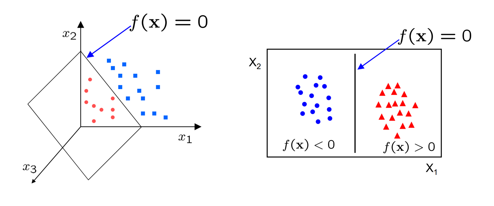
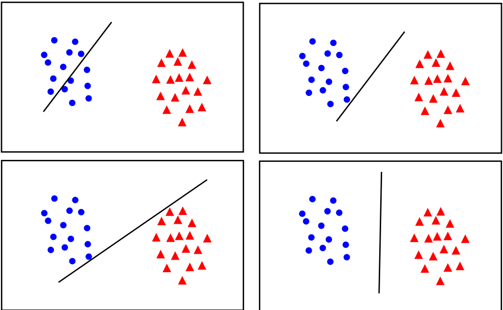
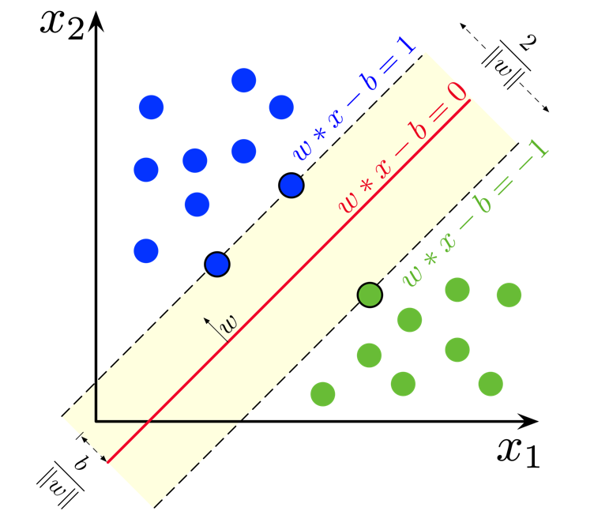
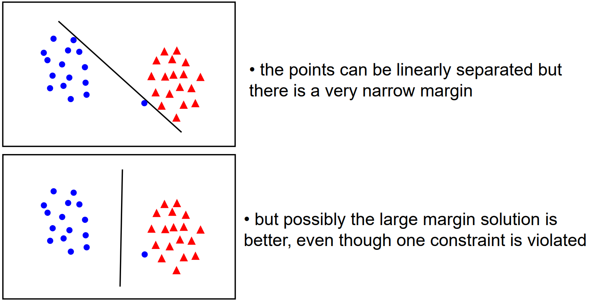
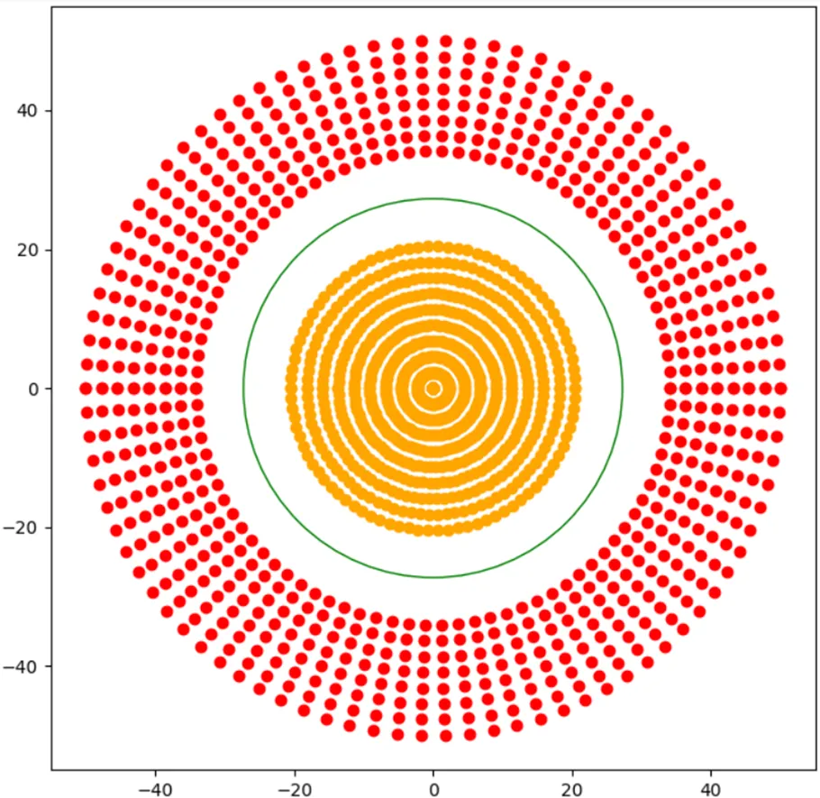
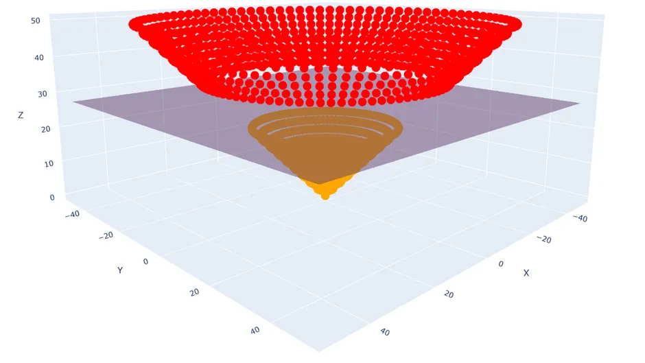

# Support Vector Machine (SVM)

## Revisiting Classification

Let's recall the problem of binary classification that we saw for the perceptron. Remember that what we essentially wanted before our activation function was some function like this

$
f(\bold{x_i}) =
\begin{cases} 
\geq 0 & \text{if } y_i = 1 \\
< 0 & \text{if } y_i = 0 
\end{cases}
$

Where the output is positive for our data point $\bold{x_i}$, if the corresponding $ith$ class label is $1$, and negative if the class label is $0$.

Note, for now, we're going to set our class labels to $1$ and $-1$. This is because we can then cleverly characterise a correct prediction as $y_i f(\bold{x_i}) > 0$.

Anyways, the way we achieved that was by setting $f$ to some linear function like $f(\bold{x_i}) = \bold{x_i} \bold{w} + b$. We also briefly mentioned that this function has a geometric interpretation. Namely, $f(\bold{x}) = 0$ represents a [hyperplane](https://en.wikipedia.org/wiki/Hyperplane) dividing our two classes.

Eventually, we ended up training our weights by defining a loss function $\mathcal{L}$, which we performed gradient descent against. The loss function we used was mean-squared error. While this was good, MSE did not put particular emphasis on how the optimal weights may generalise for unseen data. While it does try to create a sizeable gap between classes, the way it behaves is often hard to explain and extremely sensitive to pertubations in data.

For instance, while the top left of these obviously gives a high loss value, the rest all would provide "small enough" loss values for most people to assume training is complete. However, only the bottom right gives the most space to both classes to expand as needed for unseen data.

But hopefully by looking at these images, you can see what we should try to do. Instead of trying to fit all points lets focus on a few boundary points. Our aim will be to find a boundary between the classes that leads to the largest **margin** (buffer) from points on both sides.

## What is an SVM?

An SVM is a set of three parallel hyperplanes which divide the group of points $\bold{x_i}$ for which $y_i = 1$ and $y_i = -1$ so that the distance between the hyperplane and the nearest point $\bold{x_i}$ from each class is maximised. This can be summarised really quite elegantly as the following function

$
f(\boldsymbol{x_i}) =
\begin{cases}
1 & \text{if } \bold{x_i} \cdot \bold{w} + b \geq 1, \\
-1 & \text{if } \bold{x_i} \cdot \bold{w} + b \leq -1, \\
\text{Unknown Class} & \text{if } -1 < \bold{x_i} \cdot \bold{w} + b < 1.
\end{cases}
$

So, just like for logistic regression and linear regression, what we want to learn is just one set of weights $\bold{w}$ and a bias $b$. But this time we want the output $y = \bold{x_i w} + b$ to have some sense of a "margin" built in. A larger margin indicates that our predictions are more confident. The points that lie on the decision boundaries are what we call our **support vectors** because they're used to calculate the margin.

For **prediction**, the unknown class can be represented as a new number (e.g, $0$), but often _after_ training people will just get rid of the unknown class and decide the class purely based on the sign of the linear function - or in terms of the diagram, on which side of the **red** line the point falls. This is entirely a matter of personal preference.

> You'll notice here, in earlier chapters, in later chapters, and in the general literature that the way we multiply matrices is not very consistent. You might sometimes see $y = \bold{w x} + b$, $y = \bold{w^T x} + b$, $y = \bold{x w} + b$. Worse, sometimes the multiplication operation isn't clear, and $\cdot$ or $*$, might be used to represent matrix multiplication, the dot product, or even element-wise multiplication. The truth is, in large part it doesn't really matter. These all just stem from decisions of how we want to represent our data as matrices and vectors, and if we stay consistent in a project then everything is equivalent. Ideally academic papers will explicitly tell you the dimensions they're working with, like $\bold{x_i} \in \mathbb{R}^{5 \times 6}$, but especially for really large models it's anyone's guess 😂. The place where it really does matter is for performance, since the shape of matrices can have [major implications](https://github.com/attractivechaos/matmul) on how quickly you can compute their product due to cache locality and all sorts of other reasons.

## Loss Function

To train our weights and bias, we'll use gradient descent like we have done many times before. However, we'll introduce a new loss function, Hinge Loss,

$
\mathcal{L} =
\begin{cases}
0 & \text{if } y_i \cdot f(x_i) \geq 1, \\
1 - y_i \cdot f(x_i) & \text{otherwise}.
\end{cases}
= \max{(0, 1 - y_i f(x_i))}
$

Here, we can see that the loss is 0 if the predicted value $f(x_i)$ and the actual value $y_i$ are of the same sign ($y_i f(x_i) > 0$) and if the prediction falls outside the margin ($y_i f(x_i) >= 1$). Otherwise, we calculate the loss value $1 - y_i f(x_i)$ which will always be positive in the case of an incorrect prediction.

## Regularisation

Unfortunately, once we start dealing with real data, we'll often find that our classes are not so distinct as we've seen in previous diagrams. Rather, you might have some noise and some mixing between the classes. As it stands, our SVM will priortise drawing a boundary that completely separates the two classes, rather than one which creates a large boundary. But in general, there's a trade off between the margin and the number of "mistakes" in the training data.

So, to allow us to control how "soft" or "hard" our boundary should be, we add a regularisation parameter to our loss function.

$
\mathcal{L} = \lambda ||\bold{w}||^2 +  \max{(0, 1 - y_i f(x_i))}
$

Geometrically, the distance between the margin hyperplanes is $\frac{2}{||\bold{w}||}$, so maximising the distance is equivalent to minimising $||\bold{w}||$.

Thus, high values of $\lambda$ will priortise a larger margin between the classes and a softer penalty for incorrect classification, whereas smaller values of $\lambda$ will prioritise giving the correct classification on the training data.

## Gradient Descent

Generally, SVM is performed with Stochastic Gradient Descent - that is, our weights and bias are updated when calculating the loss for each sample. Since our loss has two clear cases, it's easiest to derive our gradients for gradient descent by considering them seperately.

Case 1: if $y_i f(x_i) >= 1$ (prediction is correct)

$
\mathcal{L}' (w, b) = \begin{bmatrix}
\frac{\partial \mathcal{L}}{\partial w} \newline
\frac{\partial \mathcal{L}}{\partial b}
\end{bmatrix} = \begin{bmatrix}
2 \lambda w \newline
0
\end{bmatrix}
$

Case 2: Otherwise (prediction is incorrect)

$
\mathcal{L}' (w, b) = \begin{bmatrix}
\frac{\partial \mathcal{L}}{\partial w} \newline
\frac{\partial \mathcal{L}}{\partial b}
\end{bmatrix} = \begin{bmatrix}
2 \lambda w - y_i x_i \newline
y_i
\end{bmatrix}
$

## Exercise

Your task is to implement a linear binary Support Vector Machine classifier. You must implement `fit()` which adjusts the weights and bias of your model to some training data, `predict()` which returns the predicted classes of of an array of data points.

**Inputs** - `fit()`:

- `X` is a NumPy NDArray (matrix) of data points such as `[[1, 1, 0], [0, 0.5, 3], [0.7, 0.9, 0.3]]`, representing the training data.
- `y` is a NumPy NDArray (vector) of values such as `[0, 1, 1]`, representing the corresponding (binary) class for each data point.

**Inputs** - `predict()`:

- `X` is a NumPy NDArray (matrix) of data points such as `[[1, 1, 0], [0, 0.5, 3], [0.7, 0.9, 0.3]]`, representing a set of points we want to predict a class for.

## Extra Reading: SVM Formulations

Much like Linear Regression, there are many, many techniques for computing the SVM and we only showed one here today. Broadly, most of these can be categorised as solving the _primal_ problem or the _dual_ problem, which relates to how we frame the optimisation of the loss function. There are also some more modern approaches, but we can't really cover them here since the background knowledge needed is extensive. If you feel inclined though, [Wikipedia](https://en.wikipedia.org/wiki/Support_vector_machine#Computing_the_SVM_classifier) is your friend!

The interesting point is that the difference in performance between these methods is not that great. [Chapelle et al.](https://pure.mpg.de/rest/items/item_1790269_2/component/file_3080690/content) showed in fact that both methods for solving the primal problem and the dual problem are $O(n^3)$ in complexity, with $n$ being the number of data points. However, the development of these different methods has allowed us to understand the problem of classification in much greater detail and discover more about SVMs.

## Extra Reading: Non-linear Data & The Kernel Trick

Currently, the line (or hyperplane) of our SVM is pretty straight (or flat), so how would we find a decision boundary for a dataset like this?

Recall that from the perceptron, we handled this sort of problem by introducing a non-linear activation function, but we can't do that here because our plane is inherently a linear expression.

Instead, what we can do is extend our data into a new non-linear dimension, and then find a hyperplane within that which separates our classes.

For instance, for every data point $(x_1, x_2)$ I could pipe it through the transformation $\phi: \mathbb{R}^{2 \times 1} \rightarrow \mathbb{R}^{3 \times 1}, \quad (x_1, x_2) \mapsto \left(x_1, x_2, \sqrt{x_1^2 + x_2^2}\right)$

And now clearly I can draw a hyperplane between the two classes using my ordinary SVM methods.

Unfortunately, it can be very difficult to pick the best transformation, and if we decide to use several then our problem because very computationally expensive. One thing that helps us with this is called the [kernel trick](https://towardsdatascience.com/the-kernel-trick-c98cdbcaeb3f). This basically relies on the fact that to solve the _dual_ problem, we don't need to know the result of the transformation for each point, we just need to know its similarity to other points under the same transformation. [Chapelle et al.](https://pure.mpg.de/rest/items/item_1790269_2/component/file_3080690/content) also demonstrated that this technique can be applied to solving the _primal_ problem, but it's incredibly involved.

## Extra Reading: Multiclass SVMs

In this chapter, we've only focussed on binary classification, and so you might be wondering if just like how logistic regression has a multiclass cousin in softmax regression, is there a multiclass version of SVMs? Fortuantely, there are two very intuitive approaches to solving this problem.

Firstly, there's the **one-vs-one** approach. For all pairs of k classes in our dataset, $\binom{k}{2}$, we create an SVM. Then we run our data point through all of these classifiers and pick the class with majority votes.

For example, considering 3 classes, we'd need 3 classifiers - 1 vs 2, 2 vs 3, and 1 vs 3. If the output for a datapoint fed into 1 vs 2 is class 1; 2 vs 3 is class 2; 1 vs 3 is class 1, the majority vote is class 1, which is our final result.

Secondly, there's the **one-vs-all** approach. For all k classes in our dataset, we create an SVM for that class vs any other data point not in it. Then, just like before, we run our data point through all the classifiers and pick the class with majority votes.

For example, considering 3 classes, we'd need 3 classifiers - 1 vs 2/3, 2 vs 1/3, and 3 vs 1/2. If the outputfor a datapoint fed into 1 vs 2/3 is class 1; 2 vs 1/3 is class 1 or class 3; 3 vs 1/2 is class 1 or class 2, then majority votes go to class 1, so that's our final result.
